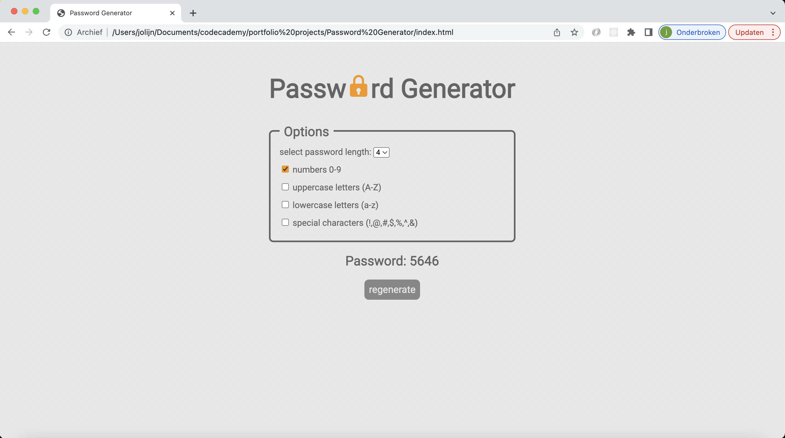

# Password Generator

 

## Description:

For my portfolio I made a password generator. With this generator you can make passwords for all sorts of accounts and devices.
It is easy to use and the passwords are customizable.

 

## Features:

This password generator has a view features:

- choose the length of your password
- Pick the options needed for your new password: upppercase letters, lowercase letters, numbers and special characters.
- regenerate as many passwords as you like.

 

## How to use:

This password generator doesn't need any installation and works in any browser. Click on this link to see the password generator in action:
[Password-generator github page](https://jolijn0101.github.io/password-generator/)
Or copy this repository and run it locally.

 

## Technologies:

The calculator is written in the code languages:
HTML, CSS and Javascript

 

## Feedback

This password generator was really fun to make. Maybe I will use it in the future for making new passwords when I ran out of creativity. I'am very happy how this project turned out.
  
Feel free to play around with it and if you have any feedback, let me know
Would be nice to learn from it.
